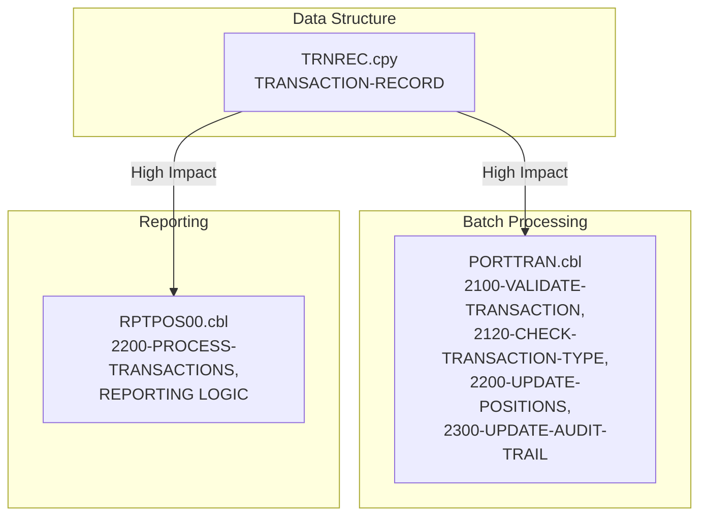

# Impact Analysis Report

## Summary

**User Story:** Add Transaction Type Field to Batch Processing and Reporting  
**Overview:**  
Add a new field, TRANSACTION-TYPE (PIC X(10)), to the transaction record layout in the relevant copybook used by both the batch processing and reporting programs. Update the transaction processing COBOL program to accept, store, and process the new transaction type field. Update the transaction report COBOL program to read and display the transaction type in the generated summary report.  
**Total impacted components:** 3  
**High-level assessment:**  
This is a medium-complexity change. It affects the core transaction data structure (copybook), the main transaction processing program, and the main reporting program. All components are tightly coupled through the transaction record layout.

---

## Ranked Impact List

| Program/Copybook      | Impact  | Nature  | Affected Paragraphs/Sections           | Dependency Path                |
|-----------------------|---------|---------|----------------------------------------|-------------------------------|
| TRNREC.cpy            | High    | Direct  | TRANSACTION-RECORD, TRN-DATA           | [TRNREC.cpy]                  |
| PORTTRAN.cbl          | High    | Direct  | 2100-VALIDATE-TRANSACTION, 2120-CHECK-TRANSACTION-TYPE, 2200-UPDATE-POSITIONS, 2300-UPDATE-AUDIT-TRAIL | [PORTTRAN.cbl, TRNREC.cpy]    |
| RPTPOS00.cbl          | High    | Direct  | 2200-PROCESS-TRANSACTIONS, FILE SECTION, REPORTING LOGIC | [RPTPOS00.cbl, TRNREC.cpy]    |

---

## JSON Metadata

```json
{
  "impactAnalysis": {
    "userStory": "Add Transaction Type Field to Batch Processing and Reporting",
    "impactedComponents": [
      {
        "programName": "TRNREC.cpy",
        "impactScore": 1.0,
        "impactLevel": "High",
        "impactType": "Direct",
        "affectedParagraphs": ["TRANSACTION-RECORD", "TRN-DATA"],
        "dependencyPath": ["TRNREC.cpy"],
        "rationale": "Core transaction record layout; adding TRANSACTION-TYPE field directly changes the structure used by all dependent programs."
      },
      {
        "programName": "PORTTRAN.cbl",
        "impactScore": 0.95,
        "impactLevel": "High",
        "impactType": "Direct",
        "affectedParagraphs": [
          "2100-VALIDATE-TRANSACTION",
          "2120-CHECK-TRANSACTION-TYPE",
          "2200-UPDATE-POSITIONS",
          "2300-UPDATE-AUDIT-TRAIL"
        ],
        "dependencyPath": ["PORTTRAN.cbl", "TRNREC.cpy"],
        "rationale": "Main portfolio transaction processing program; uses TRNREC.cpy and directly references TRN-TYPE. Must be updated to accept, process, and store TRANSACTION-TYPE."
      },
      {
        "programName": "RPTPOS00.cbl",
        "impactScore": 0.90,
        "impactLevel": "High",
        "impactType": "Direct",
        "affectedParagraphs": [
          "2200-PROCESS-TRANSACTIONS",
          "FILE SECTION",
          "REPORTING LOGIC"
        ],
        "dependencyPath": ["RPTPOS00.cbl", "TRNREC.cpy"],
        "rationale": "Main reporting program; includes TRNREC.cpy and processes transaction data. Must be updated to read and display TRANSACTION-TYPE in reports."
      }
    ]
  }
}
```

---

## Visualization



**Legend:**  
- **Red (High Impact):** Directly affected by the addition of TRANSACTION-TYPE  
- **Arrows:** Show dependency on the transaction record layout

---

**Reasoning:**  
- The copybook `TRNREC.cpy` is the core data structure for transactions and must be updated to add the new field.
- `PORTTRAN.cbl` is the primary batch transaction processing program; it includes `TRNREC.cpy` and contains logic that validates and processes transaction types.
- `RPTPOS00.cbl` is the main reporting program; it also includes `TRNREC.cpy` and will need to be updated to display the new field in reports.
- All three components are tightly coupled, and the change will propagate directly through the dependency paths.
