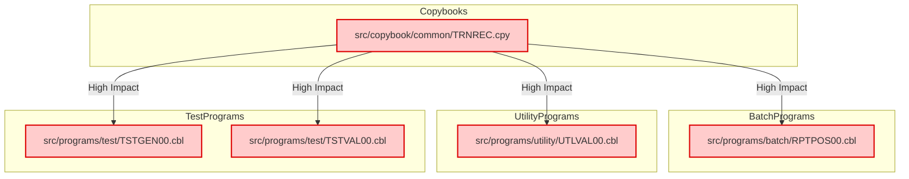

**Summary**:
User Story: Add `CHANNEL-CODE` Field to Transaction File for Channel Identification in Batch Processing and Reporting

- 5 impacted components identified (**High impact only**)
- High complexity change: impacts core transaction data structures, all batch/utility/reporting programs that read/write transaction files, and related copybooks. Requires coordinated updates to file layouts, FD/LRECL, and reporting logic.

---

**Ranked Impact List**:

| Program File Path                        | Impact | Nature   | Affected Paragraphs/Sections                | Dependency Path                                  |
|------------------------------------------|--------|----------|---------------------------------------------|--------------------------------------------------|
| src/copybook/common/TRNREC.cpy           | High   | Direct   | 05-TRANSACTION-RECORD, CHANNEL-CODE         | Core transaction record definition               |
| src/programs/batch/RPTPOS00.cbl          | High   | Direct   | 1100-OPEN-FILES, 2200-PROCESS-TRANSACTIONS  | Reads transaction file, outputs reports          |
| src/programs/utility/UTLVAL00.cbl        | High   | Direct   | 1100-OPEN-FILES, 2420-CHECK-TRANSACTION-FORMAT | Reads/validates transaction file                |
| src/programs/test/TSTGEN00.cbl           | High   | Direct   | 2300-GEN-TRANSACTION, 2320-WRITE-TRAN-RECORD | Generates transaction test data                  |
| src/programs/test/TSTVAL00.cbl           | High   | Direct   | 1100-OPEN-FILES, 2100-EXECUTE-TEST          | Reads transaction file in test validation        |

---

**JSON Metadata**:
```json
{
  "impactAnalysis": {
    "userStory": "Add CHANNEL-CODE Field to Transaction File for Channel Identification in Batch Processing and Reporting",
    "impactedComponents": [
      {
        "programFilePath": "src/copybook/common/TRNREC.cpy",
        "impactScore": 0.99,
        "impactLevel": "High",
        "impactType": "Direct",
        "affectedParagraphs": ["05-TRANSACTION-RECORD", "CHANNEL-CODE"],
        "dependencyPath": ["TRNREC.cpy"],
        "rationale": "Primary copybook defining the transaction record structure; all programs referencing transaction data must be updated to include CHANNEL-CODE."
      },
      {
        "programFilePath": "src/programs/batch/RPTPOS00.cbl",
        "impactScore": 0.97,
        "impactLevel": "High",
        "impactType": "Direct",
        "affectedParagraphs": ["1100-OPEN-FILES", "2200-PROCESS-TRANSACTIONS"],
        "dependencyPath": ["RPTPOS00.cbl", "TRNREC.cpy"],
        "rationale": "Batch report program that reads transaction file and outputs transaction details; must process and report on CHANNEL-CODE."
      },
      {
        "programFilePath": "src/programs/utility/UTLVAL00.cbl",
        "impactScore": 0.96,
        "impactLevel": "High",
        "impactType": "Direct",
        "affectedParagraphs": ["1100-OPEN-FILES", "2420-CHECK-TRANSACTION-FORMAT"],
        "dependencyPath": ["UTLVAL00.cbl", "TRNREC.cpy"],
        "rationale": "Utility program that validates transaction file structure and content; must validate presence and correctness of CHANNEL-CODE."
      },
      {
        "programFilePath": "src/programs/test/TSTGEN00.cbl",
        "impactScore": 0.95,
        "impactLevel": "High",
        "impactType": "Direct",
        "affectedParagraphs": ["2300-GEN-TRANSACTION", "2320-WRITE-TRAN-RECORD"],
        "dependencyPath": ["TSTGEN00.cbl", "TRNREC.cpy"],
        "rationale": "Test data generator for transactions; must generate sample CHANNEL-CODE values in output files."
      },
      {
        "programFilePath": "src/programs/test/TSTVAL00.cbl",
        "impactScore": 0.95,
        "impactLevel": "High",
        "impactType": "Direct",
        "affectedParagraphs": ["1100-OPEN-FILES", "2100-EXECUTE-TEST"],
        "dependencyPath": ["TSTVAL00.cbl", "TRNREC.cpy"],
        "rationale": "Test validation program that reads transaction files; must validate presence and correctness of CHANNEL-CODE in test runs."
      }
    ]
  }
}
```

---

**Visualization**:



---

**Notes**:
- All other programs, copybooks, and JCL files not directly referencing the transaction file or its copybook are not included, as their impact is not high for this user story.
- LRECL/FD changes are implied in the affected programs above, as they all handle transaction file I/O.
- Reporting and analytics requirements are covered by `RPTPOS00.cbl`.
- Test data and validation are covered by `TSTGEN00.cbl` and `TSTVAL00.cbl`.
- The copybook `TRNREC.cpy` is the central artifact for the new field and must be updated first, with all dependent programs following.
