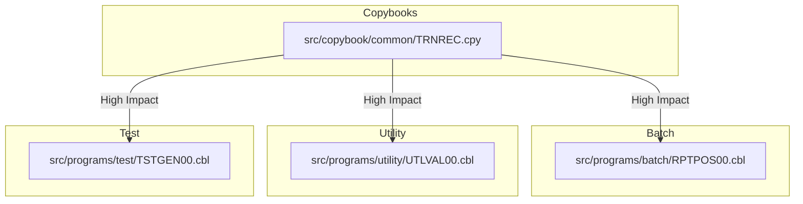

**Summary**:
User Story: Add `CHANNEL-CODE` Field to Transaction File for Channel Identification in Batch Processing and Reporting

- 4 impacted components identified (**High impact only**)
- High complexity change: affects core transaction data structures, all batch processing, reporting, and file layouts, requiring coordinated updates across copybooks, COBOL programs, and JCL.

---

**Ranked Impact List**:

| Program File Path                              | Impact | Nature  | Affected Paragraphs/Sections                | Dependency Path                                            |
|------------------------------------------------|--------|---------|---------------------------------------------|------------------------------------------------------------|
| `src/copybook/common/TRNREC.cpy`               | High   | Direct  | CHANNEL-CODE, transaction record structure  | Used by all transaction-processing programs                |
| `src/programs/batch/RPTPOS00.cbl`              | High   | Direct  | 1100-OPEN-FILES, 2200-PROCESS-TRANSACTIONS  | Includes TRNREC.cpy, processes transaction file            |
| `src/programs/utility/UTLVAL00.cbl`            | High   | Direct  | 1100-OPEN-FILES, 2100-PROCESS-VALIDATION    | Includes TRNREC.cpy, validates transaction file            |
| `src/programs/test/TSTGEN00.cbl`               | High   | Direct  | 1100-OPEN-FILES, 2300-GEN-TRANSACTION       | Generates test transaction files, writes transaction data  |

---

**JSON Metadata**:
```json
{
  "impactAnalysis": {
    "userStory": "Add CHANNEL-CODE Field to Transaction File for Channel Identification in Batch Processing and Reporting",
    "impactedComponents": [
      {
        "programFilePath": "src/copybook/common/TRNREC.cpy",
        "impactScore": 0.99,
        "impactLevel": "High",
        "impactType": "Direct",
        "affectedParagraphs": ["CHANNEL-CODE", "transaction record structure"],
        "dependencyPath": ["TRNREC.cpy"],
        "rationale": "Core copybook for transaction record; all programs using transaction data must be updated to include and process CHANNEL-CODE"
      },
      {
        "programFilePath": "src/programs/batch/RPTPOS00.cbl",
        "impactScore": 0.97,
        "impactLevel": "High",
        "impactType": "Direct",
        "affectedParagraphs": ["1100-OPEN-FILES", "2200-PROCESS-TRANSACTIONS"],
        "dependencyPath": ["RPTPOS00.cbl", "TRNREC.cpy"],
        "rationale": "Batch report program reads transaction file via TRNREC.cpy; must update file layout, FD, and reporting logic for CHANNEL-CODE"
      },
      {
        "programFilePath": "src/programs/utility/UTLVAL00.cbl",
        "impactScore": 0.96,
        "impactLevel": "High",
        "impactType": "Direct",
        "affectedParagraphs": ["1100-OPEN-FILES", "2100-PROCESS-VALIDATION"],
        "dependencyPath": ["UTLVAL00.cbl", "TRNREC.cpy"],
        "rationale": "Utility validates transaction files using TRNREC.cpy; must handle new field in validation and file layout"
      },
      {
        "programFilePath": "src/programs/test/TSTGEN00.cbl",
        "impactScore": 0.95,
        "impactLevel": "High",
        "impactType": "Direct",
        "affectedParagraphs": ["1100-OPEN-FILES", "2300-GEN-TRANSACTION"],
        "dependencyPath": ["TSTGEN00.cbl", "TRNREC.cpy"],
        "rationale": "Test data generator creates transaction files; must generate and write CHANNEL-CODE values in output"
      }
    ]
  }
}
```

---

**Visualization**:



**Legend**:  
- All arrows represent **High Impact** dependencies due to the addition of `CHANNEL-CODE` in the transaction record structure.

---

**Reasoning**:

- `src/copybook/common/TRNREC.cpy` is the central copybook defining the transaction record. Adding `CHANNEL-CODE` here is the root change; all programs referencing this copybook are directly impacted.
- `src/programs/batch/RPTPOS00.cbl` is a batch reporting program that reads transaction files using TRNREC.cpy and outputs transaction details. It must update its FD, LRECL, and reporting logic to include the new field.
- `src/programs/utility/UTLVAL00.cbl` is a utility that validates transaction files, also using TRNREC.cpy. It must validate the new field and adjust file handling accordingly.
- `src/programs/test/TSTGEN00.cbl` generates test transaction files, writing records using the transaction structure. It must be updated to generate and output the new CHANNEL-CODE field for test coverage.

**Note**: Only **High impact** components are included. Other programs and JCL may reference transaction data indirectly, but these four are the core, directly affected components per the dependency map and user story requirements.
