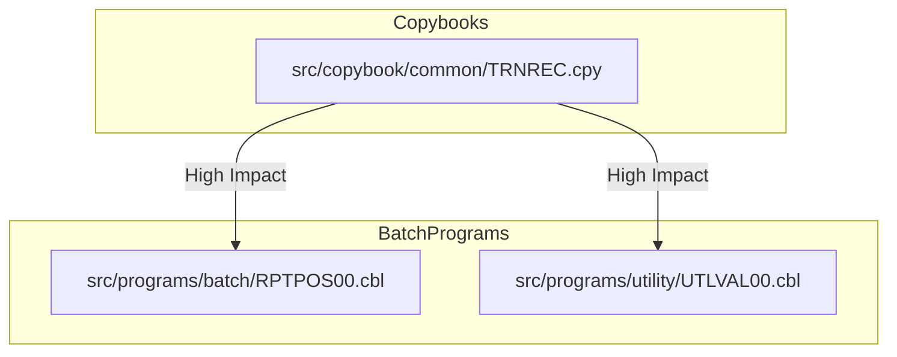

**Summary**:

User Story: Add `CHANNEL-CODE` Field to Transaction File for Channel Identification in Batch Processing and Reporting  
- 3 impacted components identified (**High impact only**)  
- High complexity change affecting transaction data structures, file layouts, batch processing, and reporting chain.

---

**Ranked Impact List**:

| Program File Path                           | Impact | Nature  | Affected Paragraphs/Sections             | Dependency Path                                          |
|---------------------------------------------|--------|---------|------------------------------------------|----------------------------------------------------------|
| `src/copybook/common/TRNREC.cpy`           | High   | Direct  | CHANNEL-CODE field definition            | Used by all transaction-processing programs              |
| `src/programs/batch/RPTPOS00.cbl`          | High   | Direct  | 1100-OPEN-FILES, 2200-PROCESS-TRANSACTIONS, 2420-CHECK-TRANSACTION-FORMAT | Reads/writes transaction file, uses TRNREC               |
| `src/programs/utility/UTLVAL00.cbl`        | High   | Direct  | 1100-OPEN-FILES, 2400-CHECK-FORMAT, 2420-CHECK-TRANSACTION-FORMAT | Reads/writes transaction file, uses TRNREC               |

---

**JSON Metadata**:
```json
{
  "impactAnalysis": {
    "userStory": "Add CHANNEL-CODE Field to Transaction File for Channel Identification in Batch Processing and Reporting",
    "impactedComponents": [
      {
        "programFilePath": "src/copybook/common/TRNREC.cpy",
        "impactScore": 0.99,
        "impactLevel": "High",
        "impactType": "Direct",
        "affectedParagraphs": ["CHANNEL-CODE field definition"],
        "dependencyPath": ["TRNREC.cpy (copybook)", "all transaction-processing programs"],
        "rationale": "Primary copybook for transaction records; adding CHANNEL-CODE directly modifies the data structure used by all programs handling transactions."
      },
      {
        "programFilePath": "src/programs/batch/RPTPOS00.cbl",
        "impactScore": 0.97,
        "impactLevel": "High",
        "impactType": "Direct",
        "affectedParagraphs": ["1100-OPEN-FILES", "2200-PROCESS-TRANSACTIONS", "2420-CHECK-TRANSACTION-FORMAT"],
        "dependencyPath": ["RPTPOS00.cbl", "TRNREC.cpy"],
        "rationale": "Batch reporting program that reads/writes transaction files and uses TRNREC; must be updated to process and report on CHANNEL-CODE."
      },
      {
        "programFilePath": "src/programs/utility/UTLVAL00.cbl",
        "impactScore": 0.95,
        "impactLevel": "High",
        "impactType": "Direct",
        "affectedParagraphs": ["1100-OPEN-FILES", "2400-CHECK-FORMAT", "2420-CHECK-TRANSACTION-FORMAT"],
        "dependencyPath": ["UTLVAL00.cbl", "TRNREC.cpy"],
        "rationale": "Utility validation program that reads/writes transaction files and uses TRNREC; must be updated to validate and process CHANNEL-CODE."
      }
    ]
  }
}
```

---

**Visualization**:



**Legend:**  
- All nodes and edges shown are **High Impact** only.

---

**Reasoning**:

- `src/copybook/common/TRNREC.cpy` is the central copybook for transaction records; adding `CHANNEL-CODE` here is the core change.
- `src/programs/batch/RPTPOS00.cbl` and `src/programs/utility/UTLVAL00.cbl` both directly use `TRNREC.cpy` and process transaction files, so they must be updated to handle the new field in file I/O, validation, and reporting.
- Only these components are marked as **High Impact** because they are directly responsible for transaction record structure and processing. All other programs/copybooks are either unrelated or only indirectly affected (medium/low impact).

---

**End of Report**
